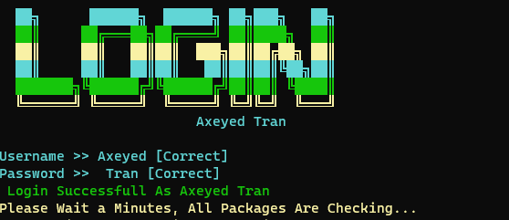
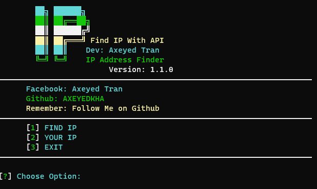

# IP_Address

Tool IP Find With API V1.1.0

# Command:

[</>] pkg install git

[</>] pkg install python

[</>] pip install requests

[</>] git clone https://github.com/AXEYEDKHA/IP_Address

[</>] cd IP_Address

[</>] python install.py

[</>] Enjoy Guy :)

# Login

USER: Axeyed

PASS: Tran

# Preview:

